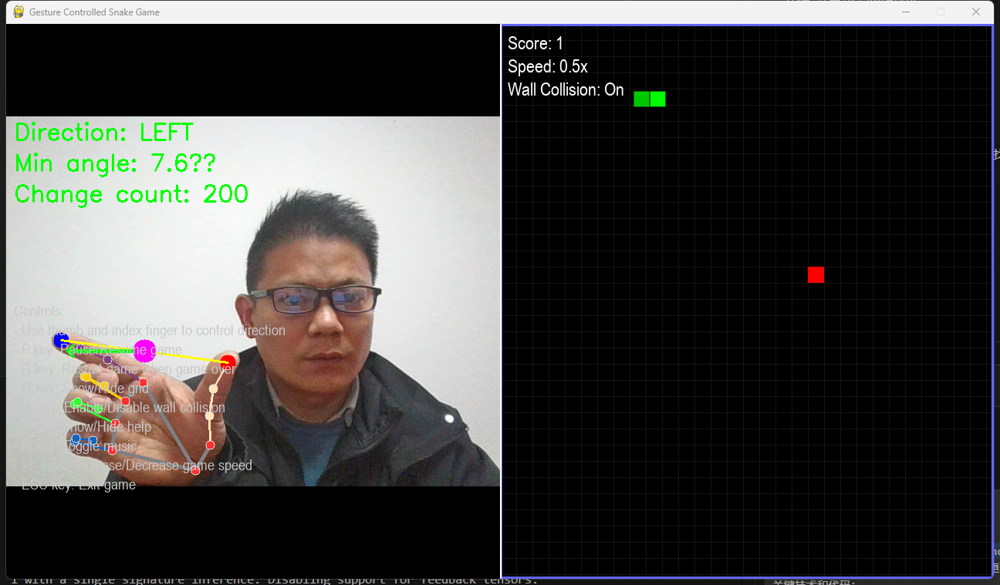

[English]() | [中文](README.md)



# Introduction

Gesture Snake is an interactive game that combines computer vision with the classic Snake game. Players control the snake's movement direction using hand gestures captured by a webcam. The game screen is split into two parts: the left side shows the real-time video feed with hand tracking, and the right side displays the Snake game.

# Features

- Control snake movement using hand gestures
- Real-time hand tracking and gesture recognition
- Split-screen interface showing both video feed and game
- Classic Snake game mechanics with proximity food detection
- Adjustable game speed based on score
- Wall collision toggle (pass through walls or game over on collision)
- Background music and sound effects
- Pause/resume functionality
- Grid display toggle
- Help information display

# How to Play

1. Position your hand in front of the webcam
2. Use your thumb and index finger to form a direction
3. The angle between your thumb and index finger determines the snake's movement:
   - Point up: Snake moves upward
   - Point right: Snake moves right
   - Point down: Snake moves downward
   - Point left: Snake moves left
4. Collect food (red squares) to grow the snake and increase your score
5. Avoid colliding with the snake's own body or walls (if wall collision is enabled)

# Controls

- **Hand Gestures**: Control snake direction
- **P key**: Pause/resume game
- **R key**: Restart game when game over
- **G key**: Show/hide grid
- **W key**: Enable/disable wall collision
- **H key**: Show/hide help information
- **M key**: Toggle music
- **+/- keys**: Increase/decrease game speed
- **ESC key**: Exit game

# Installation

1. Clone the repository:
   ```
   git clone https://github.com/yourusername/gesture-snake.git
   cd gesture-snake
   ```

2. Install dependencies:
   ```
   pip install -r requirements.txt
   ```

3. Run the game:
   ```
   python run.py
   ```

# Sound Effects

The game supports the following sound effects:
- Background music
- Food eating sound
- Direction change sound
- Game over sound

Place your sound files in the `sounds` directory with the following names:
- `background.mp3`: Background music
- `eat.mp3`: Sound when eating food
- `turn.mp3`: Sound when changing direction
- `game_over.mp3`: Sound when game is over

# Requirements

- Python 3.7+
- Webcam
- See `requirements.txt` for Python package dependencies

# Project Structure

```
gesture-snake/
├── assets/              # Images and resources
├── sounds/              # Sound effects and music
├── src/                 # Source code
│   ├── game/            # Snake game logic
│   ├── gesture/         # Hand gesture detection
│   └── __init__.py
├── tests/               # Unit tests
├── .gitignore           # Git ignore file
├── LICENSE              # MIT License
├── README.md            # This file
├── requirements.txt     # Python dependencies
└── run.py               # Main entry point
```


## License | 许可证

This project is licensed under the MIT License - see the [LICENSE](LICENSE) file for details.